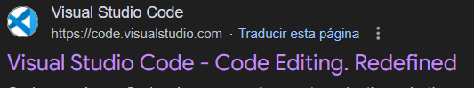
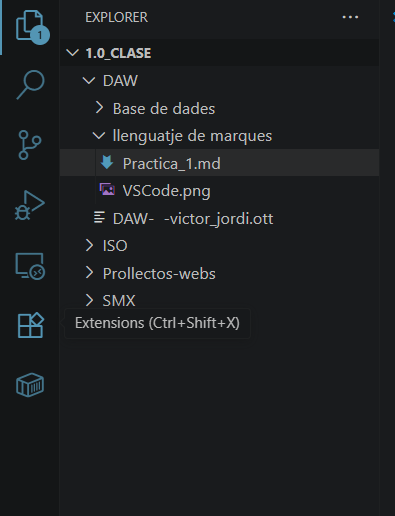

# DAW LLenguatje de marques
### Víctor Martí Sànchez


## Instalacio de VS Code

1. Busquem per internet la [Visual Stude Code](https://code.visualstudio.com/).



2. Un cop siguem a la web busquem el boto de descarrega i el [descarreguem](https://code.visualstudio..com/Download)

Un cop fet anirem a la carpeta de **Descarreges** o en la aguem seleccionat i executarem el programe.

> En windows es seleccionar seguent continuament, no hi han proves visuals degut a que ya la tenia descarregada.


## Instalacio de un Pluguin

Al instalar un pluguin el que farem es el seguent:

* Entrarem a VS Code, un cop dins buscarem a la barra lateral un apartat que posa **Extension**.



* Un cop som a dins cercarem el pluguin que bolem, en aquest cas es *Live Prewiw*.


## Competencia

En el mon de visualitzado hi han varis sistemes per programar, els mes coneguts son els seguents:

| VS Code | Code  | Vim |
|-----------|-----------|-----------|
| Visual Stude Core es una eina de programacio i edicio de codi, utilitzada principalment en sistemes operatius con Windows i Mac | Code es un eina similar a Visual Stude Code, es va cear amb la promesa de ser millor  | Utilitzat en Ubuntu juntament amb nano i similars |

## Creacio del ducument amb markdown i visualitza

Per crea el document e utilitzat de referencia aquesta mateixa practica creant una especie de guia de instalacio de Visual stude code, en el proces e realitzat la mayoria de coses que necesitavem agrear:

Tituls:
```
Titulo Nivel 1: # DAW LLenguatje de marques 
Titulo Nivel 2: ## Instalacio de VS Code
Titulo Nivel 3: ### Víctor Martí Sànchez

```
Textos:

```

Text normal: Hola

Negreta:**Extension**

Cursuva: *Live Prewiw*

Notas: > En windows es...

```

LListes:
```
LLista no numerada: * Entrarem a VS Code...

LListes numerades: 1. Busquem ...

```
Altres elements:

```
Agregar imatges: 

Enllaços: [descarreguem](https://code.visualstudio..com/Download)

Creacio de taules:
| Columna 1 | Columna 2 |
|-----------|-----------|
| Contingut | Contingut |

Enmarcament: ```a``` (No es pot posar el exemplre ya que aixo mateix es el enmarcat i fetn un espay es descuadra)

```